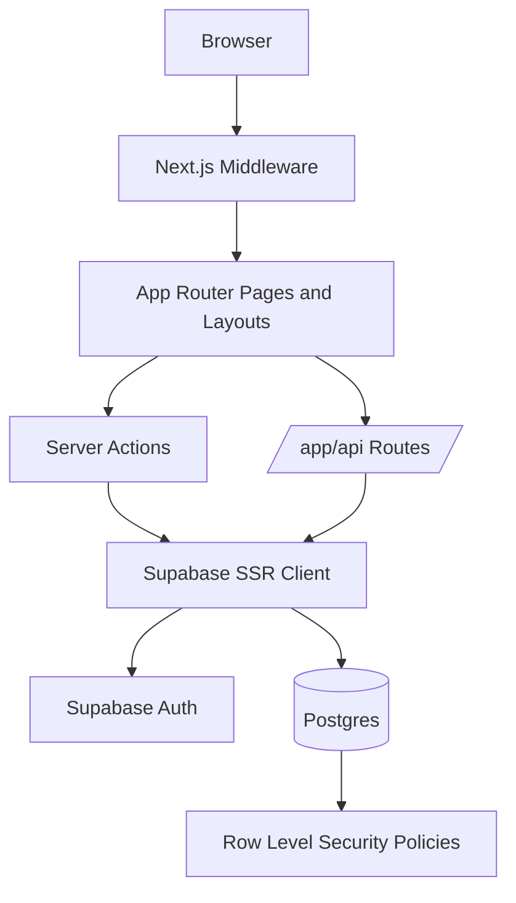
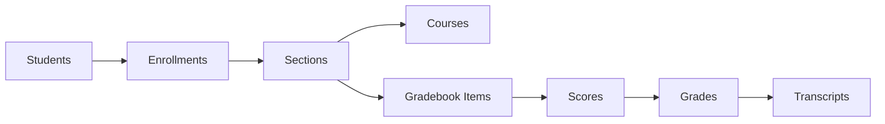

# Campus Management

Campus Management is a Next.js 15 + Supabase campus operations prototype built for hackathon-style evaluation. It covers the core academic journey end to end: role-based authentication, course browsing, enrollment with schedule-conflict protection, faculty grade entry, and student transcript/GPA review.

## Project Overview

The application models three roles:
- `student` for course discovery, enrollment, grades, and transcript access
- `faculty` for section oversight and gradebook entry
- `admin` for top-level operational visibility

The implementation is intentionally focused on the five highest-signal workflows for demo and AI-based code evaluation:
- Authentication and role-aware routing
- Course catalog browsing
- Enrollment with duplicate, capacity, and time-conflict checks
- Faculty gradebook management
- Transcript and GPA calculation

## Architecture Diagram



## Data Model Diagram



## Tech Stack

| Layer | Technology |
| --- | --- |
| Framework | Next.js 15 (App Router) |
| Language | TypeScript 5, strict mode |
| Styling | Tailwind CSS v3 |
| UI Primitives | shadcn-style reusable components |
| Auth | Supabase Auth |
| Database | Supabase Postgres |
| Validation | Zod |
| Unit Testing | Vitest |
| E2E Testing | Playwright |
| Deployment Target | Vercel |

## Database Design Summary

The schema is split into four logical areas:

### Identity and RBAC
- `roles`
- `users`
- `students`
- `faculty`

### Academic Catalog
- `courses`
- `sections`

### Academic Progress
- `enrollments`
- `gradebook_items`
- `gradebook_scores`
- `grades`
- `transcripts`

### Security
- Row Level Security is enabled on all application tables.
- The app uses Supabase SSR clients so route handlers and server components execute under the current user session.
- Role-aware checks exist in middleware, server utilities, and API context helpers.

## Key Features

- Role-based authentication for student, faculty, and admin users
- Course catalog browsing with section timing, room, instructor, and capacity metadata
- Enrollment workflow with schedule conflict, capacity, duplicate enrollment, and prerequisite checks
- Faculty gradebook with item creation and batch score submission
- Student transcript with derived grade breakdown and GPA calculation
- Shared dashboard shell with role-aware navigation and authenticated layout guards

## Security Model

### Row Level Security
- RLS is enabled on all tables: `roles`, `users`, `students`, `faculty`, `courses`, `sections`, `enrollments`, `gradebook_items`, `gradebook_scores`, `grades`, and `transcripts`.
- Students can only access their own profile, enrollments, grades, transcript rows, and scores.
- Faculty can only access sections they teach and the related roster, score, and grade data.

### Role-Based Access Control
- Application roles are stored in `roles` and linked through `users.role_id`.
- Route-level access is enforced in `middleware.ts`.
- Server-side access is enforced through `requireUser`, `requireRole`, `requireAuthenticatedContext`, `requireStudentContext`, and `requireFacultyContext`.

### Server-Side Authorization Checks
- Auth pages redirect authenticated users to the correct role home.
- Protected routes reject unauthenticated users before page render.
- API handlers enforce role and profile checks before reading or mutating data.
- Database RLS remains the final enforcement layer.

## Demo Flow

1. Sign in as faculty and open a section gradebook.
2. Create or review gradebook items and submit student scores.
3. Sign in as a student and verify grades, weighted percentages, and GPA on the transcript page.
4. Sign in as admin to inspect the operational dashboard and seeded user data.

## Demo Accounts

| Role | Email | Password |
| --- | --- | --- |
| Admin | `aditi.narang@demo-campus.edu` | `Demo@12345` |
| Faculty | `ananya.iyer@demo-campus.edu` | `Demo@12345` |
| Student | `aarav.sharma@demo-campus.edu` | `Demo@12345` |

## Setup Instructions

### Prerequisites
- Node.js 20+
- A Supabase project

### Environment Variables

Create `.env.local` or `.env` and provide:

```bash
NEXT_PUBLIC_SUPABASE_URL=
NEXT_PUBLIC_SUPABASE_ANON_KEY=
SUPABASE_SERVICE_ROLE_KEY=
```

### Install Dependencies

```bash
npm install
```

### Apply Database Migrations

Apply the SQL files in `supabase/migrations/` to your Supabase project in timestamp order. The repository includes:
- core schema creation
- role and auth insert policies
- gradebook tables
- demo data seed
- demo auth repair migrations

### Start the App

```bash
npm run dev
```

Open `http://localhost:3000`.

### Validation Commands

```bash
npm run lint
npm run typecheck
npm test
```

## API and Architecture Docs

- Architecture: [`doc/ARCHITECTURE.md`](doc/ARCHITECTURE.md)
- API reference: [`doc/API.md`](doc/API.md)
- Schema and RLS log: [`doc/SCHEMA.md`](doc/SCHEMA.md)

## Testing Coverage

The repository includes meaningful automated coverage for:
- auth action redirects and logout behavior
- enrollment conflict, capacity, and duplicate-enrollment logic
- GPA aggregation and transcript fallback behavior
- grade submission validation and malformed payload handling
- identifier and API contract validation

## Repository Readiness for AI Evaluation

This repository is structured to make review and evaluation straightforward:
- documented architecture and API contracts
- strict TypeScript configuration
- validated request and response schemas
- role-aware security boundaries
- repeatable seeded demo accounts and academic data
