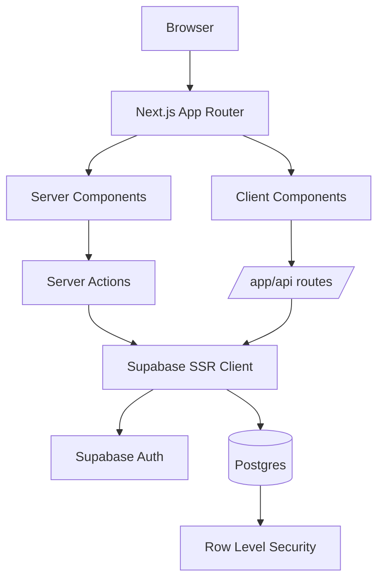

# Architecture

## Overview

Campus Management is a Next.js 15 App Router application backed by Supabase Auth and Postgres. The MVP implements five core academic workflows: authentication, course browsing, enrollment with conflict checks, faculty grade entry, and student transcript/GPA review.



## System Layers

| Layer | Responsibility | Key Files |
| --- | --- | --- |
| Presentation | Page rendering, shared dashboard shell, form UI, responsive navigation | `app/(auth)`, `app/(dashboard)`, `components/layout`, `components/ui` |
| Application | Route handlers, server actions, role-aware orchestration, response normalization | `app/api`, `app/(auth)/actions.ts`, `app/(dashboard)/actions.ts` |
| Domain | Enrollment rules, transcript aggregation, grade aggregation, auth context enforcement | `lib/api`, `lib/enrollment`, `lib/auth` |
| Validation | Request/response contracts and identifier checks | `lib/validations` |
| Data & Security | Session hydration, Supabase access, Postgres schema, RLS policies | `lib/supabase`, `supabase/migrations`, `middleware.ts` |

## Frontend Architecture

### Route Groups
- `app/(auth)` contains public authentication screens and server actions for login, registration, and logout.
- `app/(dashboard)` contains all authenticated dashboards and feature pages behind shared shell chrome.

### Rendering Model
- Server Components are the default for dashboard pages and read-heavy screens.
- Client Components are used only where interactivity is required, such as gradebook editing, dropdowns, and menu toggles.
- Middleware refreshes the Supabase session on every request and guards route prefixes before page rendering.

### Shared UI System
- `components/layout/AppShell.tsx` provides the global dashboard frame.
- `components/layout/AppHeader.tsx` renders the sticky top bar and user menu.
- `components/layout/AppSidebar.tsx` renders role-aware navigation.
- Reusable UI primitives live in `components/ui` and follow shadcn-style composition with Tailwind utility classes.

### Navigation & Access
- Canonical protected paths are `/student`, `/faculty`, `/admin`, and `/courses`.
- Legacy `/dashboard/*` paths are mapped in middleware to the current route structure.
- `lib/auth/server.ts` enforces server-side role checks for layouts and actions.

## API Layer

### Surface Area
- Auth is implemented as Server Actions in `app/(auth)/actions.ts`.
- JSON APIs are implemented under `app/api/*`.
- The API surface is grouped by catalog, enrollments, gradebook, grades, transcripts, and role-scoped profile summaries.

### Request/Response Contracts
- Request payloads and path params are validated with Zod schemas in `lib/validations`.
- Response payloads are validated before returning for dashboard-critical endpoints and the catalog/enrollment/gradebook endpoints.
- Shared response schemas now live in:
  - `lib/validations/api-contracts.ts`
  - `lib/validations/dashboard-api.ts`

### Authorization Model
- `requireAuthenticatedContext` ensures a valid Supabase session plus an application role.
- `requireStudentContext` adds a verified `students` profile.
- `requireFacultyContext` adds a verified `faculty` profile.
- Role-specific routes reject callers before any data mutation is attempted.

### Error Model
- Route handlers return a common JSON error envelope:

```ts
type ApiErrorBody = {
  error: string;
  message: string;
};
```

## Database Schema

### Identity & RBAC Tables
- `roles`
- `users`
- `students`
- `faculty`

### Academic Catalog Tables
- `courses`
- `sections`

### Academic Progress Tables
- `enrollments`
- `gradebook_items`
- `gradebook_scores`
- `grades`
- `transcripts`

### Core Relationships
- `users.id` maps 1:1 to `auth.users.id`
- `students.user_id` and `faculty.user_id` map role-specific profiles to `users`
- `sections.course_id` links offerings to `courses`
- `sections.faculty_id` links offerings to `faculty`
- `enrollments.student_id` and `enrollments.section_id` connect students to sections
- `gradebook_items.section_id` links assessments to sections
- `gradebook_scores.item_id` and `gradebook_scores.student_id` link student performance to assessments
- `grades.enrollment_id` stores one final grade per enrollment
- `transcripts` summarize GPA-relevant outcomes per student enrollment

## RBAC Model

### Roles
- `student`
- `faculty`
- `admin`

### Enforcement Points

| Layer | Enforcement |
| --- | --- |
| Middleware | Redirects unauthenticated users, prevents cross-role route access, maps legacy dashboard paths |
| Layouts & Server Actions | `requireUser()` and `requireRole()` protect server-rendered routes and mutations |
| API Routes | Context helpers verify auth, role, and backing domain profile before reads/writes |
| Database | RLS policies constrain row visibility and allowed mutations |

### Access Summary

| Role | Primary UI Access | Primary API Access |
| --- | --- | --- |
| Student | Dashboard, courses, enrollments, transcript | `/api/courses`, `/api/enrollments`, `/api/enrollments/my`, `/api/grades`, `/api/transcripts/me`, `/api/students/me`, enrolled section gradebooks |
| Faculty | Dashboard, sections, gradebook | `/api/faculty/me`, `/api/gradebook/items`, `/api/gradebook/scores`, `/api/grades`, owned section gradebooks |
| Admin | Admin dashboard and user views | Shared authenticated read routes; admin-specific JSON APIs are intentionally minimal in the MVP |

## RLS Security Strategy

### Principles
- RLS is enabled on every application table.
- Route handlers use the standard Supabase SSR client so reads and writes execute under the caller's session.
- Service-role access is limited to registration/profile provisioning fallback logic where session timing can otherwise block setup.

### Policy Strategy by Table Group

| Table Group | Policy Intent |
| --- | --- |
| `roles` | Authenticated users can read role metadata |
| `users` | Users can read and update only their own app profile |
| `students`, `faculty` | Users can read and update only their own role profile |
| `courses`, `sections` | Authenticated users can read catalog and section data |
| `enrollments` | Students manage their own enrollments; faculty can read enrollments for sections they teach |
| `gradebook_items` | Faculty can manage items only for sections they own; authenticated reads support dashboard views |
| `gradebook_scores` | Faculty can manage scores only for sections they own; students can read only their own scores |
| `grades` | Faculty can read/write grades for taught sections; students can read only their own grades |
| `transcripts` | Students can read their own transcript rows; faculty can read transcript rows tied to their sections |

### Why RBAC and RLS Both Exist
- RBAC provides route- and handler-level intent checks in the application layer.
- RLS provides database-level enforcement if a route is misconfigured or a query path changes later.
- The two layers deliberately overlap so access control does not rely on UI behavior alone.
